# Regular Users

## Registration
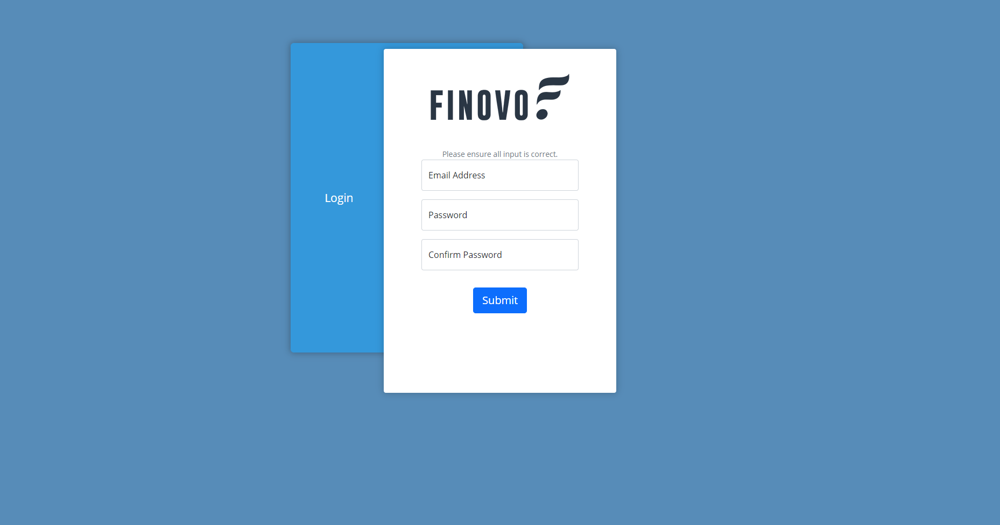
If you are attempting to register, then your company would have informed you of this service, and your company email address should already be registered with us. Please complete the registration process by confirming your email address, and setting a password.
## Login
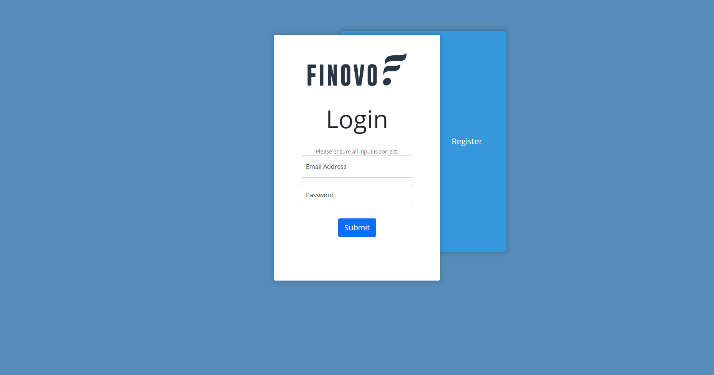
Log into your account with your company email address, and password you set.
## Logout
You can find the logout button at the bottom of the side navigation bar on the left side of the page. This side navigation bar can be accessed from most pages, and is at most a page away.

## Dashboard
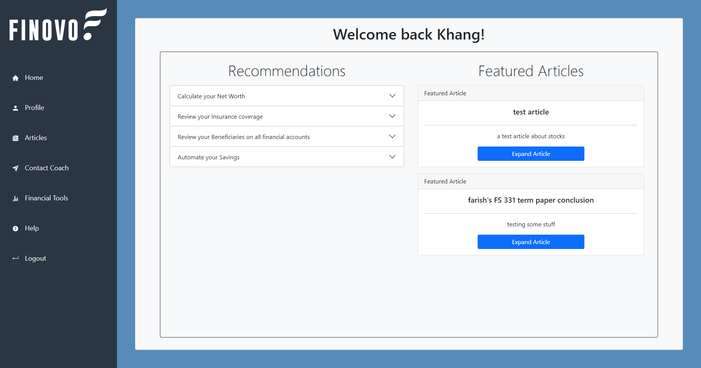
Your dashboard is a little hub that shows you a few recommendations (if they exist), as well as any featured articles. On your first time logging in, you’ll notice a notification that asks you to complete the Questionnaire if you’d like more recommendations based on your financial situation.

## The Questionnaire
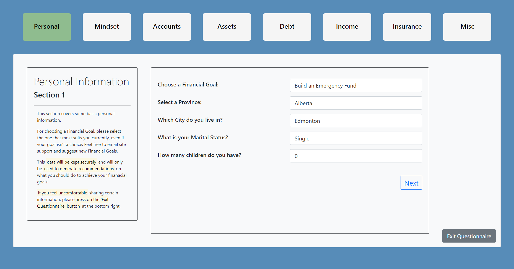
The questionnaire is something you can optionally fill out to provide us a better understanding of your financial situation so that we can give you recommendations on what to do, tailored to your situation. This data is kept confidential, and only site administrators can view it. This data will also help our financial coaches have a better understanding of your situation before your appointment, so that the hour you book isn’t wasted on explanation, and spent more on what to do.

## View/Edit Profile
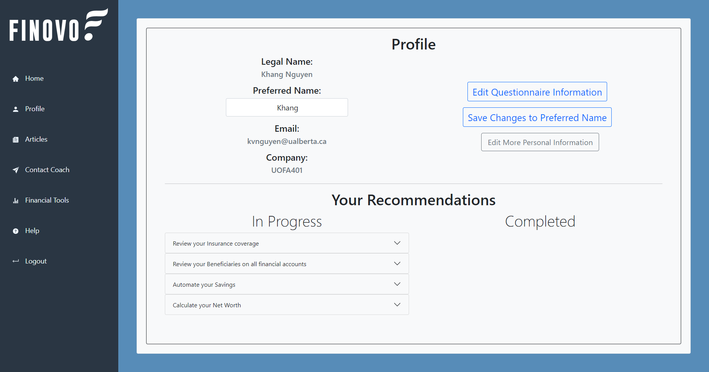
Pressing on the ‘Profile’ button on the side navigation bar will bring you to your profile page. On this page you will see some information about yourself, some buttons, and all of your recommendations, completed or not.

You can set a Preferred Name for yourself. This is purely a ‘cosmetic’ value that will only be shown to you (and our admins) on your dashboard. It is completely optional.

You can also access the questionnaire from this page to update your information at any time.

All of your recommendations will appear in 2 lists on this page. You can check recommendations to be completed, as well as unchecking completed recommendations to be incomplete if you had accidentally checked it. 

## View Articles
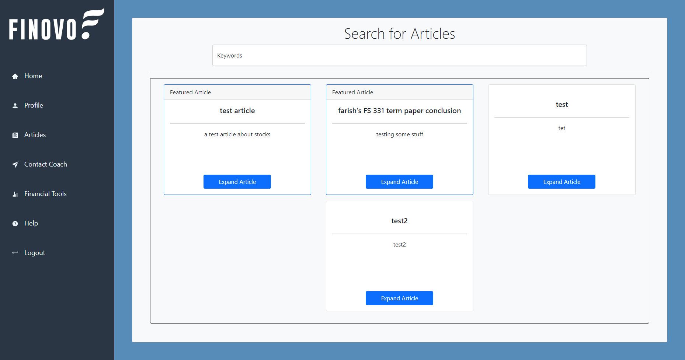
Pressing the ‘Articles’ button on the side navigation bar will bring you to a page that contains all of the articles we are currently offering. You can type into the search bar keywords, e.g. “Stocks”, and any article with that keyword in the title, description, or even category, will be filtered and shown to you. From there you can press on the expand article button to be directed to a new page that is dedicated to showing the content of the article.

You can press the ‘Go Back’ button to go back to the articles list page, or just press on any of the side navigation buttons.

## Contact Financial Coach
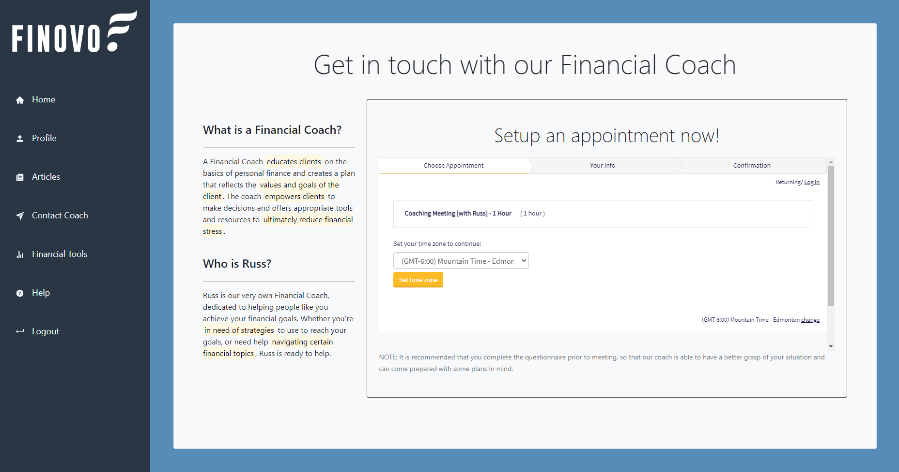
Pressing on the ‘Contact Financial Coach’ button will bring you to a page that allows you to book an appointment with our financial coach.

## Get Help from Site Support
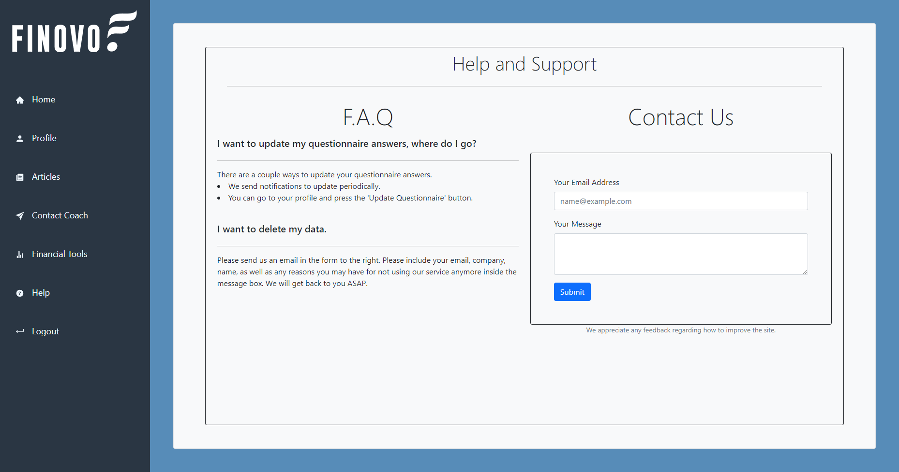
Pressing on the ‘Help’ button will bring you to a page that contains a small FAQ section, as well as a form you can fill out to contact site support. If you have any problems with the site, this is where you’d look for help. Please note, it may take a day before you receive a response.

## Financial Tools
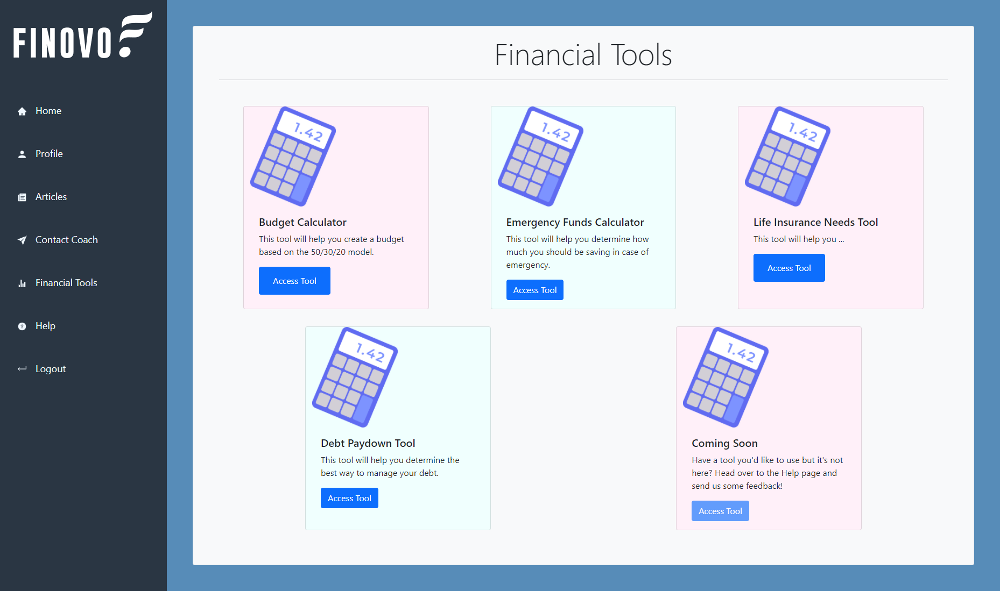
Pressing on the ‘Financial Tools’ button will bring you to a page that has a list of financial tools you can access and use. If there is a tool you’d like to use, just press on the ‘Access Tool’ button and you’ll be redirected to a new page.

Your results will be saved and you can access them in your profile.

# Admins
## Login
Log into your account with your registered email address, and password you set.
## Logout
You can find the logout button at the bottom of the side navigation bar on the left side of the page. This side navigation bar can be accessed from most pages, and is at most a page away.

## Dashboard
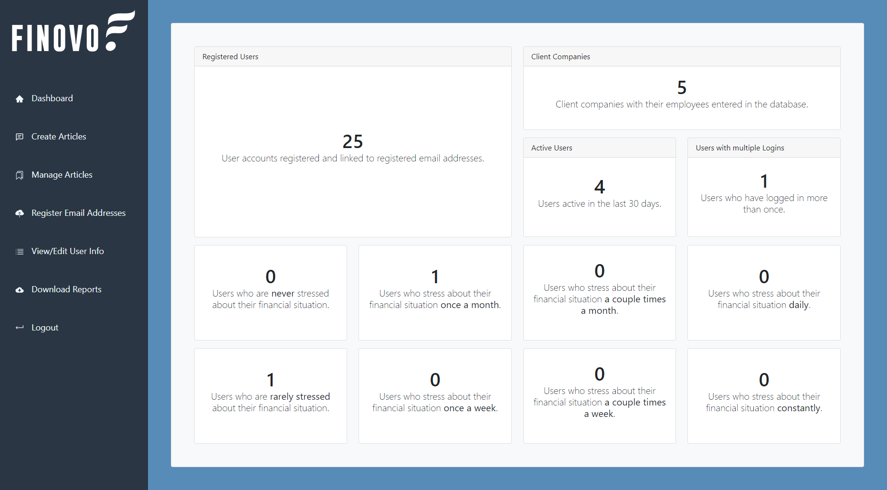
On your dashboard you’ll see little cards that contain statistics gathered about all the users in the system. They are meant to be something to glance at on login.

## Create Articles
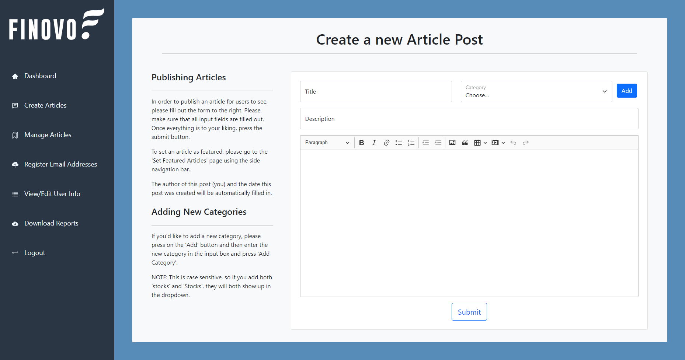
Pressing on the ‘Create Article’ button on the side navigation bar will bring you to a page with a text editor you can fill out and write up an article in.
	
You are also able to select/create new categories for your articles.
When an article is created, it will be available for all users to see on their articles list page.

## Manage Articles
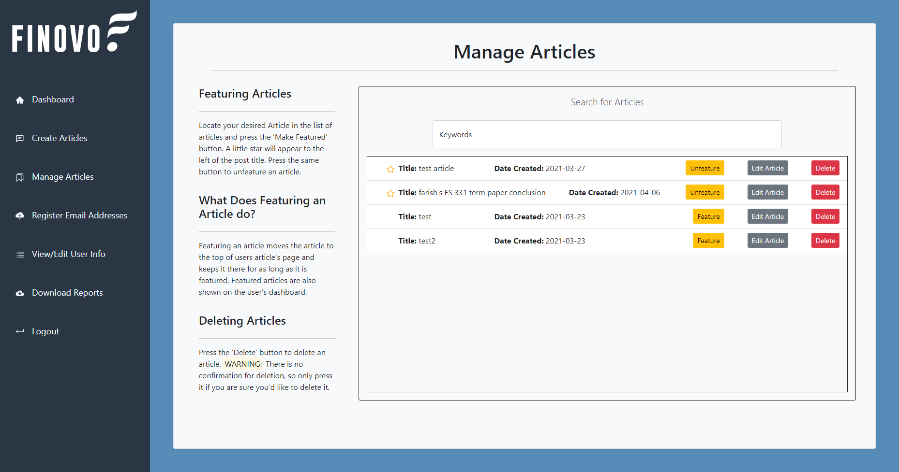
Pressing on the ‘Manage Articles’ button on the side navigation bar will bring you to a page where you can see a list of all articles in the system, and do one of the following actions:
  Set an article as Featured/Unfeature an article
  Edit the contents of an article
  Delete an article

Setting an article as featured ensures that all users will see it; the article will be posted on every user’s dashboard, and is pinned to the top of the articles list page.
	
Editing an article’s contents will direct you to a page similar to the create article page. 

Deleting an article is an irreversible process. Once that button is pressed it will be gone forever. Users will not be able to view it.

## Register New Email Addresses
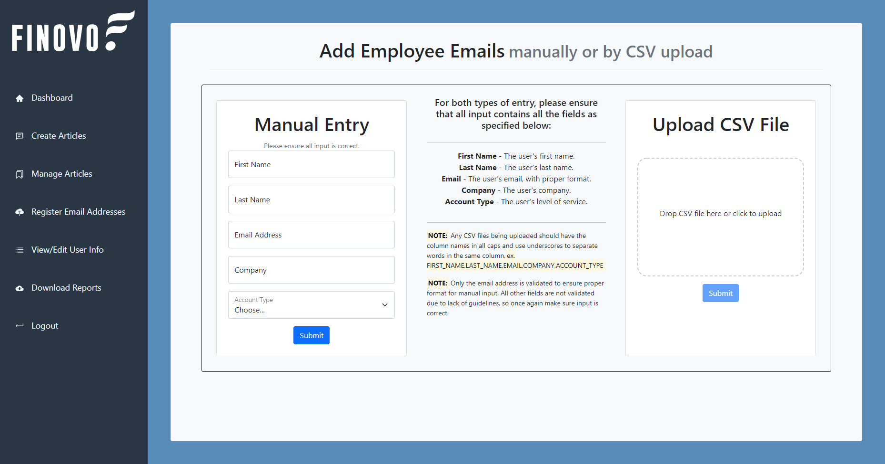
Pressing on the ‘Register New Email Address’ button will direct you to a page that contains a manual input form, as well as a drop zone for csv files that contain rows of client employee information to add to the database. Once a client employee’s email address has been registered, they are able to complete the registration process.

## View/Edit User Info
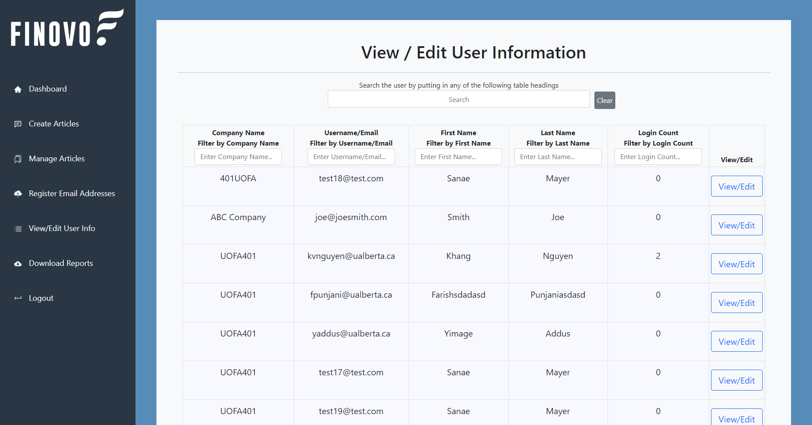
Pressing on the ‘View/Edit User Info’ button will bring you to a page that contains a list of all the users in the database (not including admins), and you will be able to sort users and search for users with keywords. Each row will contain an edit button where you can go to view a user’s information and edit it if you have to.

## Download Reports
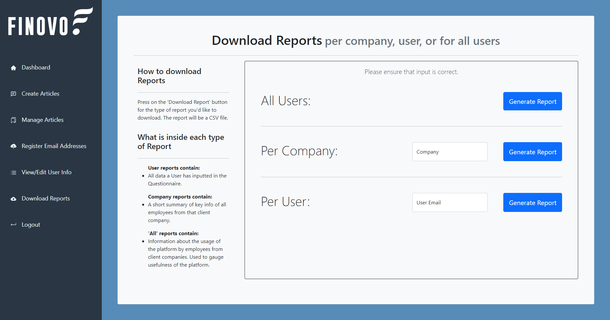
Pressing on the ‘Download Reports’ button will bring you to a page that allows you to download Reports. There are 3 kinds of reports: All Reports; Company Reports; and User Reports.
	
The All reports contain general information and statistics of the site’s users. Each row is a different company, and the data in the row is based on the employees from that company.

The Company report contains general information about all of the users from that company. Each row is for a different client employee.

The User report contains all of the information about a single user. Everything from their questionnaire data to their profile information.
